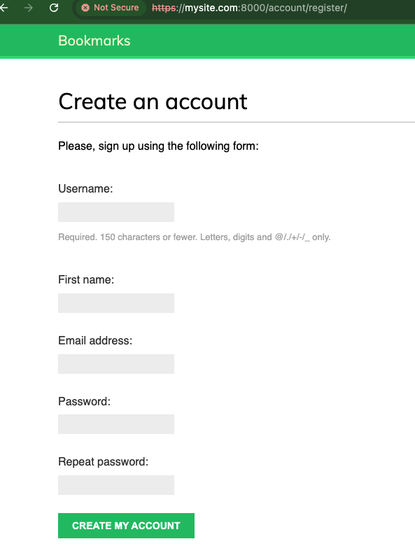
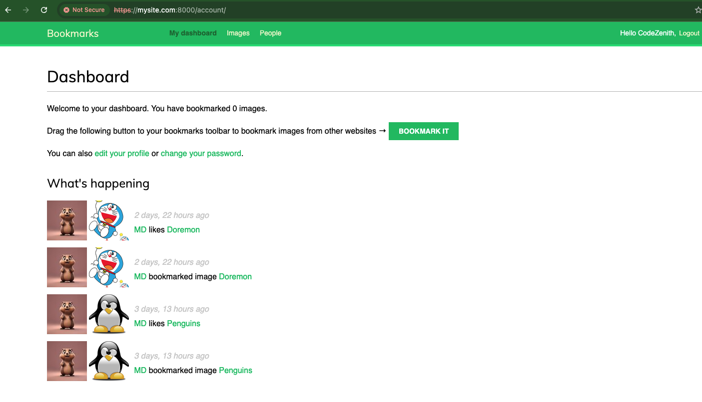
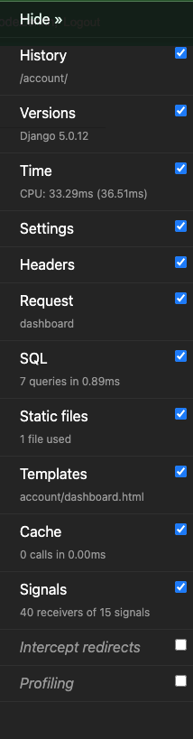
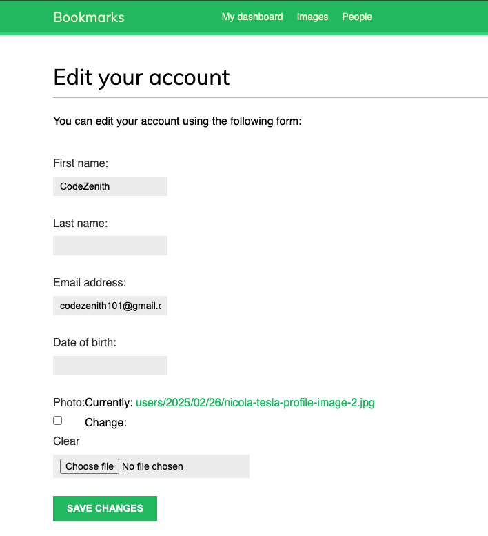
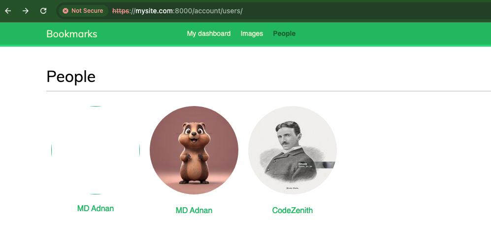
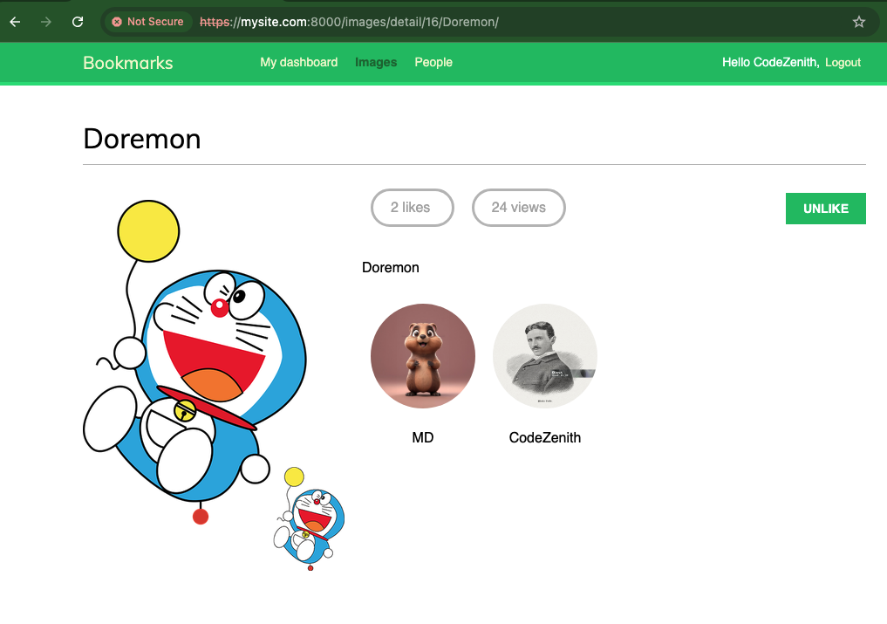
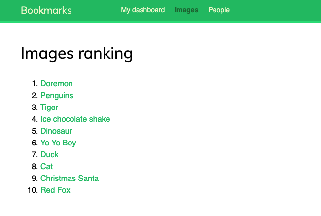
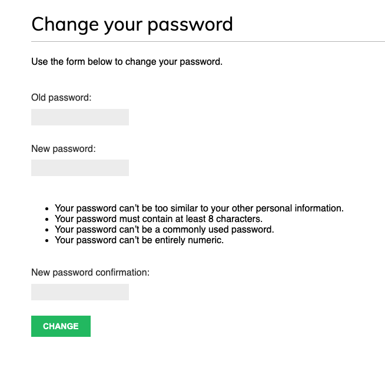
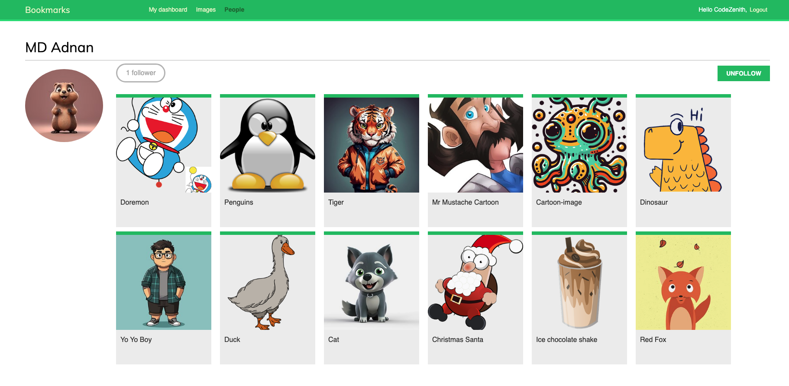

# The Social Website

The social application will allow users to share images that they find on the internet.

## Table of Contents

- [Features](#features)
- [Installation](#installation)
- [Usage](#usage)
- [Configuration](#configuration)
- [Screenshots](#screenshots)

## Features

List the key features of the project:

- An authentication system for users to register, login, edit their profile, and change or reset their password.
- Social authentication to sign in with services such as Google.
- Functionality to display shared images and a system for users to share images from any website.
- We will allow users to bookmark images from external websites and share them on our site.
  - The user drags a link from the site to their browser's bookmarks bar. The link contains JavaScript code in its href attribute. The code will be stored in their bookmark.
  - The user navigates to any website and clicks on the bookmark in the bookmarks or favorites bar. The JavaScript code of the bookmark is executed.
- An activity stream that allows users to see the content uploaded by the people that they follow.
- A follow system to allow users to follow each other on the website.
- Redis and Django to count image views and generate an image ranking.
- Running the development server through HTTPS.
- Created image thumbnails using easy-thumbnails.
- Added infinite scroll pagination to the image list.
  - Loading the next results automatically when the user scrolls to the bottom of the page.
- Used the contenttypes framework.
  - Added generic relations to the models.
- Optimized QuerySets that involve related objects.
  - `select_related()`
  - `prefetch_related()`
- Worked with Signals.
- Used Django Debug Toolbar.
  - Uncomment from the settings.py file - `INTERNAL_IPS = [
'127.0.0.1',
]`
- Counting image views with Redis
  - Stored the total number of times an image has been viewed
- Storing a ranking in Redis
  - Store a ranking of the most viewed images on the platform.

## Installation

### Prerequisites

Ensure you have the following installed:

- Python (version 3.12.4)
- Django (version 5.0.4)
- PostgreSQL

### Steps to Install

1. Clone the repository:
   ```sh
   git clone https://github.com/yourusername/yourproject.git
   cd yourproject
   ```
2. Create and activate a virtual environment:
   ```sh
   mkdir env
   python -m venv env/bookmarks
   source env/bookmarks/bin/activate
   ```
3. Install dependencies:
   ```sh
   pip install -r requirements.txt
   ```
4. Set up the database:
   ```sh
   python manage.py migrate
   ```
5. Create a superuser (optional for admin access):
   ```sh
   python manage.py createsuperuser
   ```
6. Run the development server:
   ```sh
   python manage.py runserver
   ```
7. Run the development server through HTTPS:
   ```sh
   python manage.py runserver_plus --cert-file cert.crt
   ```
8. Download the Redis Docker image and start the Redis Docker container
   ```sh
    docker pull redis:7.2.4
   ```
   ```sh
    docker run -it --rm --name redis -p 6379:6379 redis:7.2.4
   ```

## Usage

Provide instructions on how to use the project, including any necessary commands.

## Configuration

### Environment Variables

Create a `.env` file and configure the following variables in the bookmarks directory:

```
DEBUG=True
GOOGLE_OAUTH2_KEY=your_oauth2_key
GOOGLE_OAUTH2_SECRET=your_secret_key
```

## Screenshots

Below are some screenshots of the application:

### Create an Account



### Dashboard



### Django Debug Toolbar



### Edit Profile



### List of Users



### Image Details



### Most Viewed Image Ranking



### Log In


### Reset Password



### View Followers Profile



---
